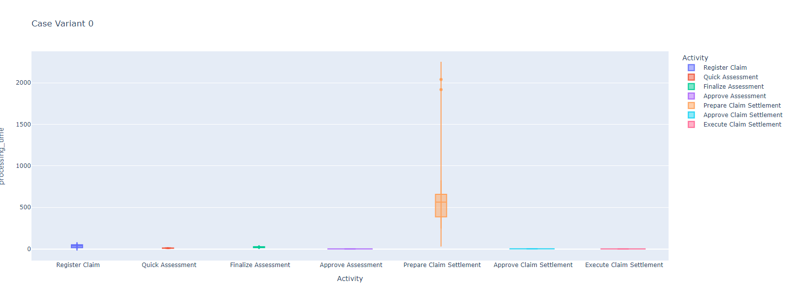
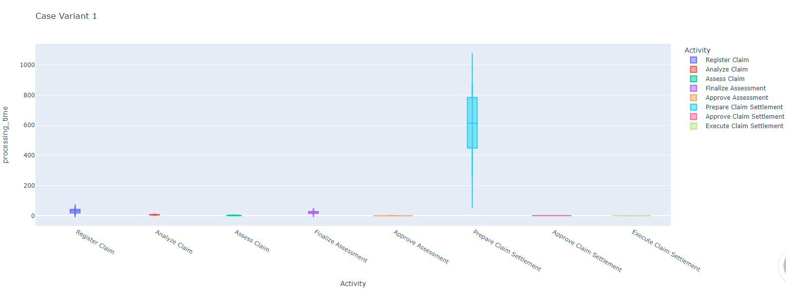
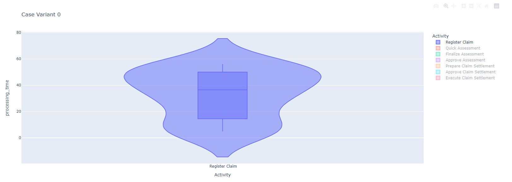
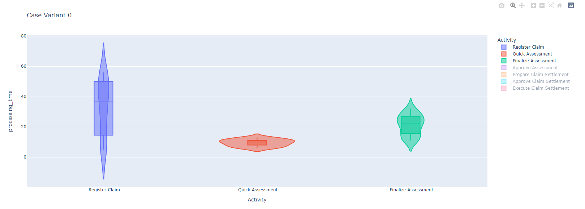

# Library comparison setup guide - DASH

## Setup:
Run the following commands to set up the virtual environment:
- venv\Scripts\activate (WIN) | source venv/bin/activate (MAC / LINUX)
- pip install -r requirements.txt

## General information
The dataset used for this demo can be found in /data/
The origination of the data is the event log, split into two groups:
- Conform SLA (within 14 days)
- Non conform SLA

## Small showcase:

The webpage resulting in running the script contains a separate diagram for each case varaint found in the dataset.
Dash' simple UI that makes it possible to isolate 1 or more events from a plot to study in depth.
Some sample showcase's below:

#### Case Variant 1

#### Case Variant 2

#### Isolation of a single activity from one case variant

#### Isolation of three activities from the same case variant

#### Minor note about data
The only data captured are the events, this is obvious. However this might not be sufficient to map out the waiting time between activities. I propose that waiting times are also captured for each activity and stored in a different dataset. This will potentially improve the visualisation of the violin graph.

### 2nd June 2022
I spent the majority of the day experimenting with Dash.
I came to the conclusion that the data we are using lacks some key values to fullfil the needs of this project. I need to find an efficient way to parse the different case variants from the dataset. Apromore supports this but it would be an insanely tedious task to manually split the data into logs based on their case variant. I will continue to explore this.

The next issue is capturing waiting time between the activities. As the mock visualizations show the various activities with a grey box signifying waiting time. It would require me to do on the spot calculations to find the average waiting time between each activity or to precalculate this waiting time before running a model. Efficiency of calculation will define this.

The afternoon I spent working on transforming the data into usable bits. Some minor reworks in existing code happened. Currently the data is being read, each case's flow is made and is waiting to be grouped by variant type. If this works as I think it works there wont be a need for preprocessing in Apromore anymore.

### 6th June 2022
Today i spent trying to visualize case variants for a tiny showcase and idea approval. The scope is clear, the visualisation however I'm not 100% sure of, hence the activities of today.

The morning was spent figuring out how to use pandas to do the heavy lifting for me. I learned a few new things and managed to capture the total time of each process and the processing time of each activity. The next step is to capture the waiting time between each activity as this time will be colored differently.
The current visualisation gives some good info. Just looks ugly :D. I will improve the visual aspect once the data is correctly captured.

The afternoon I spent figuring out how I will add a case variant identifier to the dataset. Apromore can do this but requires manual work which I'd prefer to avoid.
Im trying yo find a reasonable and efficient way to solve this problem. I've decided to wait with this implementation until I can meet with Marlon to ask if there is a code sample from Apromore that does the sampling.

### 7th June 2022
Today I will spent finding the waiting time between each activity as this is a vital part of the visualisation.
I solved the end_time miscalculation by splitting the methods and handling end_time calculation different than the start_time calculation. end time is now as follows:
rel_end_time = (processing_time + rel_start_time)

This also removes the 1 minute offset the previous methods created.

In the afternoon I managed to complete the majority of the data preprocessing.
Right now the dataset is split into their case_variants. where each activity has their relative time compared to the previous task of their process. the waiting time between the activities (waiting time between 2 activities is on the line of the starting activity.) the processing time of the activity.
The violin plot is currently pretty rough as it shows all variants together in the same diagram. The next task i think is to either split the plots per case diagrams however Dash allows for isolation already so this would mostly be a visual improvement.

Some statistics were already given to about the dataset. I will now try to solidify these by making some calculations like the claim value of the conform and nonconform processes, the amount of rework loops in certain processes, etc...

### 8th June 2022
This morning I made some final touches to the preproccesing methods. The data is now, as far as the demo scope goes, fully transformed and usable for visualization.
I wrote a small methods that splits the dataset by case variant and generates a separate violin plot for each of them. We can now see the individual task performance of each case variants activities.

The next step is figuring out how to incorporate and visualize waiting times. I think I should use a different plot to visualize this, or I have to create a new row between each activity for the waiting time. The second approach sounds a bit rough to do but I will tackle both ideas.

Quick note on the visual aspect of each case variant. The plotting tool allows for isolation (by color -> diff activity). So in an overview this plot looks really weird because prepare claim settlement has a long duration. You can select the tasks you want to inspect and then the plots look much more like violin plots.

An idea that came up during the afternoon was to use a (DistPlots)[https://plotly.com/python/distplot/] to represent the distribution of the process duration with waiting times included. Since the waiting times are already calculated and the activity processing time is also there we can plot the activities as distributions of their average duration with greyspace (waiting time) average durations in between.
Im experimenting a little with this plot to find a way + how to transform the data to visualise this.

### 9th June 2022
I started the day with a simple waiting time visualisation. The webpage is now split into 2 pages, 1 for processing times and 1 for waiting time visualisation.
It's basically the same concept as the processing time except with a subset of the data containing the waiting time instead of the processing time. The goal today is to find a way to get a combined view of the waiting time and the processing time.

A small visual update I will push is the hardcoding of a color scheme. Currently Dash automatically assigns a color to a plot based on its position in the list. I want to make sure that each Activity will always have a unique color. This makes it easier to identify and compare.

https://plotly.com/python/bar-charts/
One of the charts here, horizontal cumulative bar ,might be a good solution for the problem. I'm not sure it will work but i think with some more small transformations i might be able to capture the flow of 1 case. This i would then need to scale to the different case variants, which in turn brings another set of problems like overlap. I tend to aim more towards a distroplot for this.

Color schemes work now. It took me a while to solve this. I will most likely adjust the dataset to have a number for the activity instead of the string value. This will ask for some refactoring of existing code. This will make the code also more efficient.

I spent some time in the afternoon finding a better plot to visualise the distribution of the activity processing times and waiting times. Im waiting for confirmation before actually implementing this but I did create a concept model.

### 10th June 2022
I will spend my time today finding different solutions for the visualisation of the complete flow of a case variant (waiting time included)
I will also change the color scheme to the colors described in the vis.drawio document.

I'm trying to figure out how Dash can show a multiplot distribution so that I can visualize all activities. So far no success. I might explore another library today to solve this.

https://matplotlib.org/stable/plot_types/stats/eventplot.html#sphx-glr-plot-types-stats-eventplot-py

I will test these ideas in the afternoon. I think an eventplot might be what we're looking for. I can also capture the waiting time between the activities then without having to assign a separate row.

During the standup meeting i learned that there is a code fragment to get the waiting times for each activity.
I will refer to this fragment and redesign the transformation methods so they work more efficient next. The dataset is too small to notice a performance issue, I will receive a larger dataset to test the efficiency of the code later.

### 13th June 2022
Today was a rough day without much progress.
I will ask some help to get me sorted.

I'm currently exploring how to make the code more efficient so it can handle larger datasets but this will most likely require a large rewrite of the existing code.
This will be my task for this week, as I will need to read and learn a lot about Pandas before we can continue.
