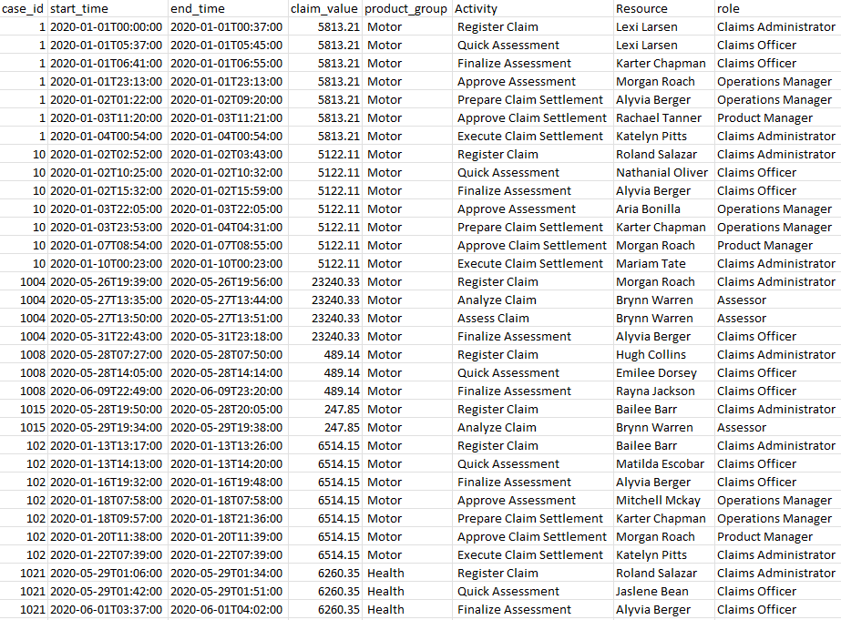
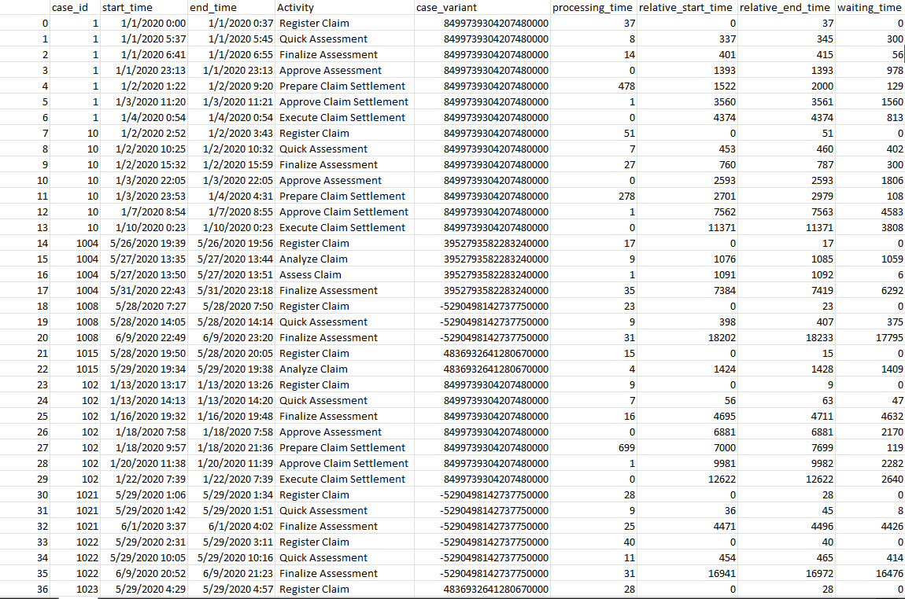
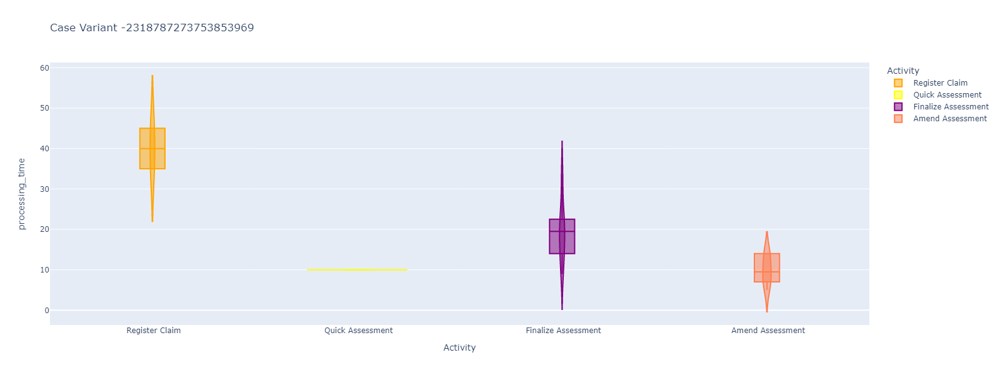
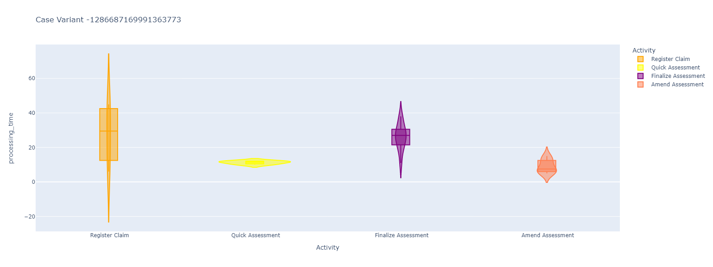
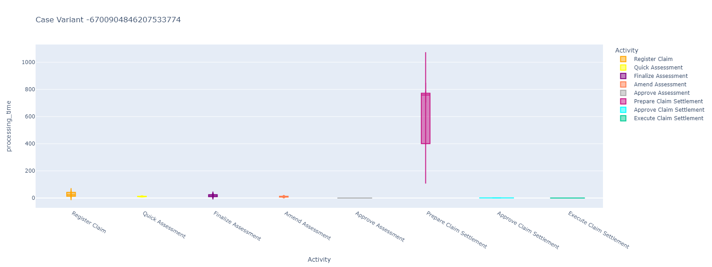
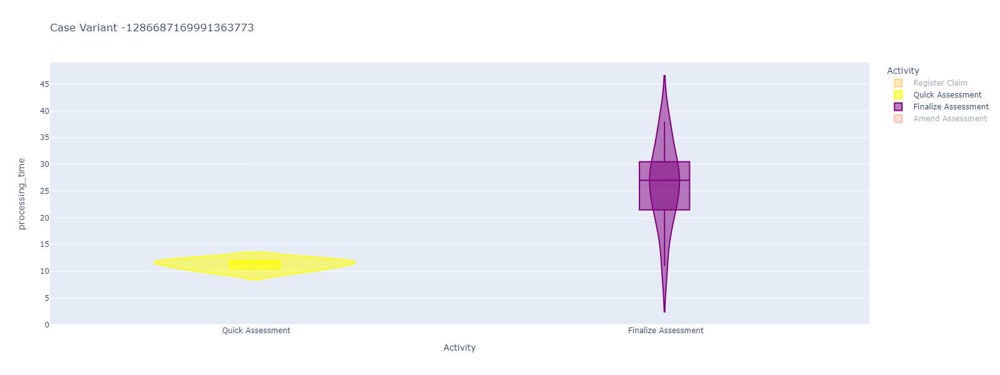
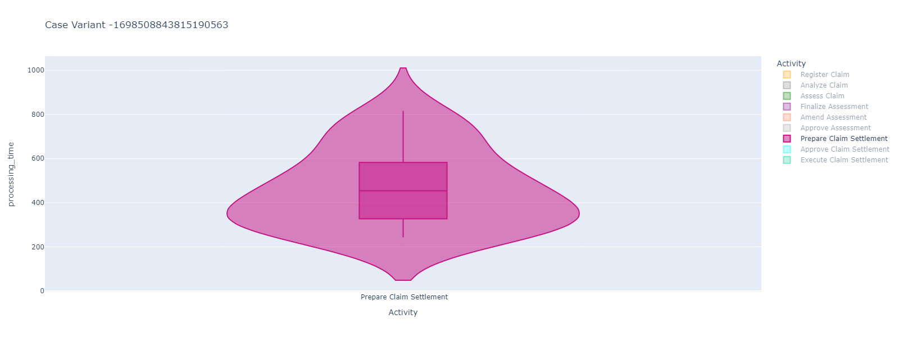
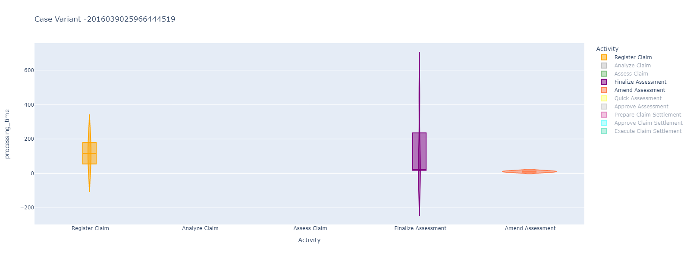

# Predictive Process Mining: Preprocessing and visualisation

This project preprocesses an event log and calculates the activity process time, the cumulative process time and waiting time between activities.
This DataFrame will then be written to a .CSV log that can be used as output or can be shown in a rudimentary web app. (with (Plotly) Dash)

You can follow my daily diary log here: [Diary](./diary/DIARY.md)

## Setup:

There is a dependency: [Start time estimator](https://github.com/AutomatedProcessImprovement/start-time-estimator) that has to be installed separate.
I'm currently manually adding this dependency through PyCharm.
```
python -m venv venv
venv\Scripts\activate
pip install -r requirements.txt
```

## Execution:
To execute the preprocessing only and retrieve the extended output log. This log can be found in data\results\data.csv __(Subject to change)__
```
python src\preprocessing.py
```

To show the violin plot results of each case variant:
```
python src\app.py
```

## Showcase:
- Data showcase: 

After running the [preprocessing.py](./src/preprocessing.py) script on this dataset we receive an event log with the following information added to it

- Resulting data: 

If you choose to run the [app.py](./src/app.py) script, a local Flask server will be started where you can see the visual results of this log.
The data is split by case variant and individually visualised using (Plotly) Dash. Each case variant is represented by a violin plot.

Some examples:
#### Case Variant 1 example

#### Case Variant 2 example

#### Case Variant 3 example


In each violin plot, you can isolate or filter certain activities out or in to get a better comparative insight between case variants.
Each activity should have its own representative color, making it easier to identify.
Some examples:
#### Isolated Case 1 example

#### Isolated Case 2 example

#### Isolated Case 3 example



## Additional notes:

This is the second iteration of this preprocessing module. In theory all information is there to capture everything requested.
This has not been achieved yet. The main improvements over the previous version is the processing time by code refactor.

Currently, this module can preprocess around 260K - 300K rows in 2 minutes. The demo dataset is small enough that barely any time is taken.
The longest waiting times come from the visual representation of the dataset. One way to combat this issue is to take the output log and then visualise with a more powerful engine

The next step in this project is capturing the whole process in a bar chart. This way we can capture waiting times between processes.
Some ideas:
- Event plot
- Bar Chart
- Other libraries than Dash..

## TODO
Show statistics of dataset:
- % of cases per case variant + absolute # - Done
- Sorted list of results (highest occurrence first)
- Give a meaningful number to case variant (instead of hash) - In progress
- Visualise by retaining only 50% of plot
- Try out different plotting technique (Event plot)